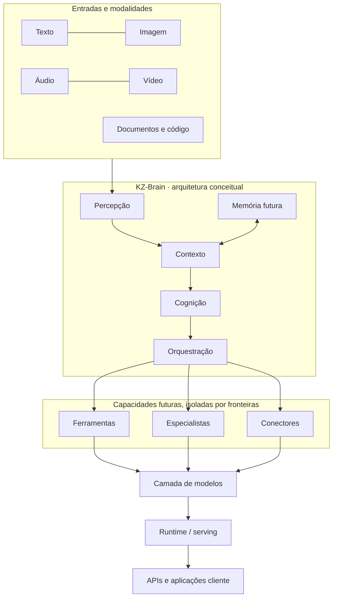

  
  
<strong>Uma fundação modular para pesquisa e engenharia de infraestrutura de inteligência artificial.</strong>

  
<kbd>FOUNDATION / ARCHITECTURE STAGE</kbd> &nbsp; <kbd>RUNTIME: NOT IMPLEMENTED</kbd> &nbsp; <kbd>MODEL: NOT IMPLEMENTED</kbd>

---

## Visão rápida

KZ-Brain é o espaço de arquitetura e pesquisa para uma futura infraestrutura própria de IA. O repositório organiza limites, conceitos, documentação e decisões que poderão orientar sistemas de dados, modelos, cognição, memória, ferramentas, conectores, avaliação e serving.

**Este repositório ainda não contém um sistema de IA executável.** Não há modelo, treinamento, tokenizer funcional, inferência, API, agentes, banco de dados ou integração ativa.

> **The KZ-Brain runtime and AI model are not implemented yet.**

## Navegação

- [Visão do projeto](docs/vision/project-vision.md)
- [Arquitetura geral](ARCHITECTURE.md)
- [Diagrama de sistema](architecture/diagrams/system-overview.mmd)
- [Roadmap](ROADMAP.md)
- [Princípios](PRINCIPLES.md)
- [Documentação por domínio](docs/README.md)
- [Registros de decisão (ADRs)](architecture/decision-records/README.md)
- [Referências públicas](docs/research/references.md)
- [Contribuição](CONTRIBUTING.md)
- [Mídia e identidade visual](docs/media/README.md)

## Arquitetura em uma página

O diagrama representa uma **hipótese de arquitetura de software**, não uma reprodução literal do cérebro humano nem uma capacidade disponível hoje. Ver [diagramas detalhados](architecture/diagrams/README.md).

## Roadmap

A única fase atual é **Fase 0 — Foundation**. As fases seguintes são intenções de planejamento, sem datas ou promessas de entrega. [Ver roadmap completo](ROADMAP.md).

## Documentação

A documentação está organizada por visão, arquitetura, modelo e dados, treinamento, inferência, cognição, memória, ferramentas, conectores, agentes, segurança, multimodalidade, operações e pesquisa. Todas as páginas distinguem os conceitos futuros do que já existe no repositório.

## Identidade e mídia

A identidade visual original do projeto está em [`assets/brand/`](assets/brand/). Diagramas de arquitetura e fontes visuais estão em [`assets/`](assets/). Não há vídeo oficial publicado; [referências audiovisuais](docs/media/videos/README.md) são apenas links de pesquisa.

## Contribuir

Leia [CONTRIBUTING.md](CONTRIBUTING.md), respeite os limites da fase atual e use os templates de issue e pull request. Propostas de arquitetura devem explicar alternativas, riscos, segurança, privacidade e impacto nas fronteiras.

## Licença

Nenhuma licença de código aberto foi concedida neste repositório. Consulte [LICENSE](LICENSE) antes de reutilizar qualquer conteúdo. A ausência de licença não equivale a autorização de uso.

## Referências

As fontes públicas verificadas estão reunidas em [docs/research/references.md](docs/research/references.md). Referências não verificadas ficam explicitamente pendentes, sem links presumidos.
