# Roadmap

> Roadmap sem datas. Somente a Fase 0 está marcada como atual; as etapas futuras dependem de pesquisa, decisões e validação.

| Fase | Tema | Estado |
|---|---|---|
| 0 | Foundation | **Atual** — organizar arquitetura documental, identidade, regras e governança |
| 1 | Data Architecture | Planejada |
| 2 | Tokenizer | Planejada |
| 3 | KZ-Brain Model | Planejada |
| 4 | Training Infrastructure | Planejada |
| 5 | Evaluation | Planejada |
| 6 | Inference Runtime | Planejada |
| 7 | Cognition | Planejada |
| 8 | Memory | Planejada |
| 9 | Tools | Planejada |
| 10 | Agents | Planejada |
| 11 | Multimodal | Planejada |
| 12 | API | Planejada |
| 13 | Developer Platform | Planejada |
| 14 | Production Infrastructure | Planejada |

## Critério de avanço

Uma fase só pode ser considerada iniciada após escopo aprovado, ameaças e privacidade avaliadas, dependências identificadas, métricas definidas e revisão humana registrada. A tabela não representa datas, capacidade, desempenho ou compromisso de lançamento.

```mermaid
flowchart LR
  F0[0 · Foundation<br/>ATUAL] --> F1[1 · Data Architecture] --> F2[2 · Tokenizer] --> F3[3 · Model]
  F3 --> F4[4 · Training] --> F5[5 · Evaluation] --> F6[6 · Inference]
  F6 --> F7[7 · Cognition] --> F8[8 · Memory] --> F9[9 · Tools]
  F9 --> F10[10 · Agents] --> F11[11 · Multimodal] --> F12[12 · API]
  F12 --> F13[13 · Developer Platform] --> F14[14 · Production]
```

